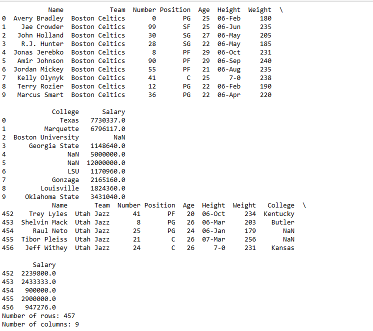

# EX11 Read-from-CSV

## AIM:
To read the contents from a csv file.

## ALGORITHM:
### Step 1:
Start the program.
### Step 2:
Create a file nba.csv in anaconda navigator.
### Step 3:
Write a program to read the contents in the csv file.
### Step 4:
Run the program.
### Step 5:
Print the output.

## PROGRAM:
```
# To write a python program for reading content from a csv file
# Developed by: HARINI R
# Register number: 212223100010

import pandas as pd
df=pd.read_csv('nba.csv')
print(df.head(10))
print(df.tail())
print("Number of rows:",len(df.axes[0]))
print("Number of columns:",len(df.axes[1]))
```
## OUTPUT:

## RESULT:
Hence, the contents are read successfully.